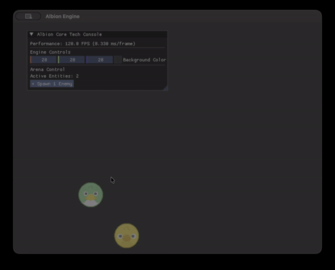
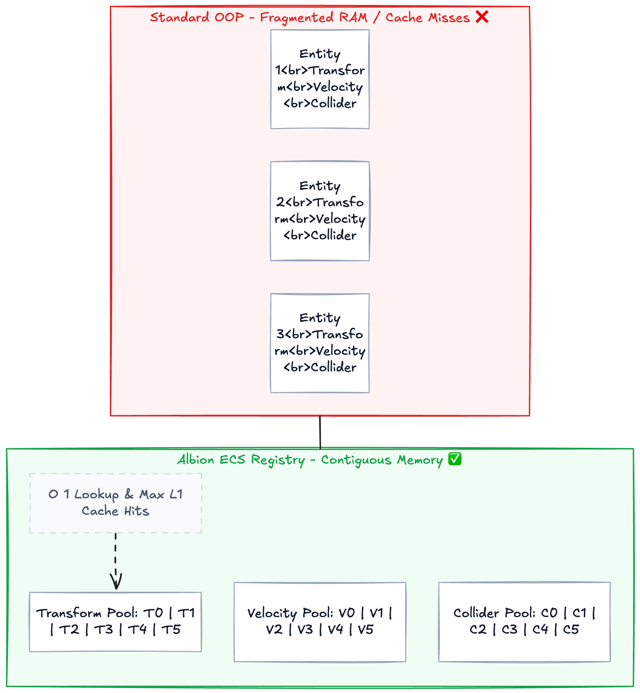
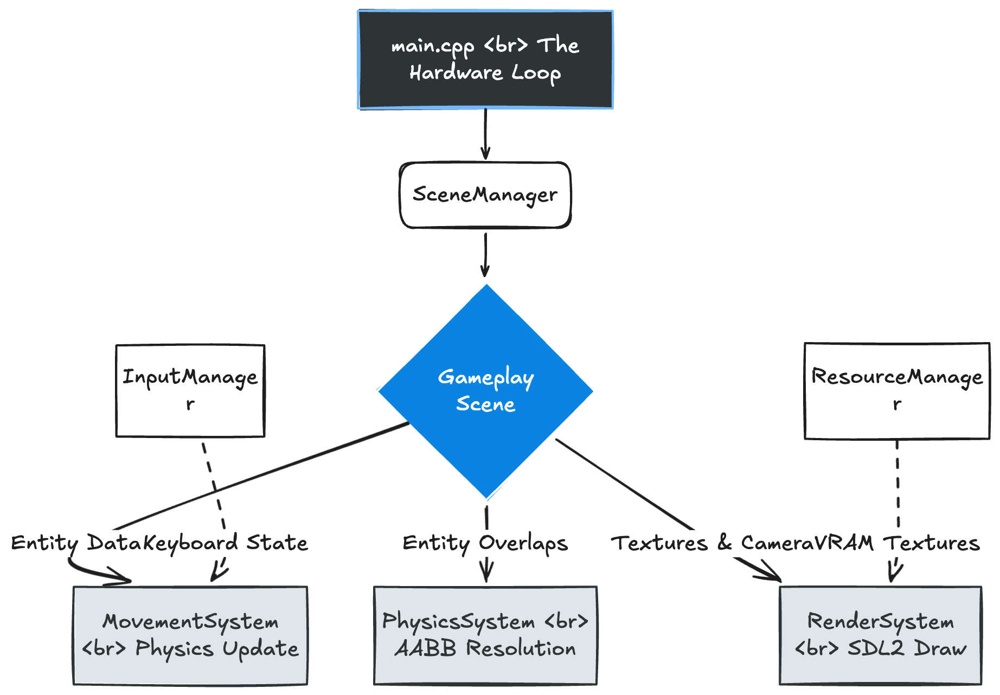

# Albion Engine ⚙️

**Author:** Kavin Moudgil  
**Tech Stack:** C++17, SDL2, SDL2_image, Dear ImGui, CMake

Albion is a highly optimized, 2D game engine architecture built entirely from scratch. It was engineered to demonstrate low-level systems programming concepts, prioritizing CPU cache locality, hardware-agnostic physics, and decoupled logic via a custom Entity-Component-System (ECS).



---

## 🚀 Core Architectural Pillars

### 1. Data-Oriented ECS (Entity-Component-System)

Instead of relying on fragmented Object-Oriented memory, Albion utilizes a custom ECS. Components are pure data structs packed tightly into contiguous `std::vector` memory pools within the `Registry`.

- **The Result:** Guaranteed `O(1)` component lookups, minimized cache misses, and massive L1 cache efficiency during system iterations.



### 2. Hardware-Agnostic Physics

- **Delta-Time ($\Delta t$) Integration:** The game loop queries high-resolution hardware clocks to decouple physics math from the CPU framerate, ensuring identical execution speeds across 60Hz and 144Hz monitors.
- **Elastic AABB Collision:** Custom discrete collision detection logic resolving multiple overlapping bounding boxes with kinetic energy transfer (bouncing).

### 3. Developer Tooling & Resource Management

- **Dear ImGui Overlay:** Integrated real-time developer console running natively over the SDL2 renderer, allowing live manipulation of entity pooling and framerate profiling without recompilation.
- **VRAM Resource Vault:** Centralized `ResourceManager` mapping GPU textures to `std::unordered_map` hashes to prevent memory leaks and redundant disk I/O.

---

## 📊 The "Billiard Swarm" Benchmark

To stress-test the contiguous memory pools, Albion includes an interactive physics benchmark. Using the ImGui developer console, users can inject entities into the active arena at runtime. The engine handles continuous AABB bounding-box calculations, velocity inversions, and rendering for the entire swarm while maintaining a locked framerate.



---

## 🛠️ Build Instructions (macOS / Linux)

### Prerequisites

Ensure you have a C++17 compliant compiler, CMake, and the required SDL2 libraries.

```bash
# macOS (Homebrew)
brew install cmake sdl2 sdl2_image
```
